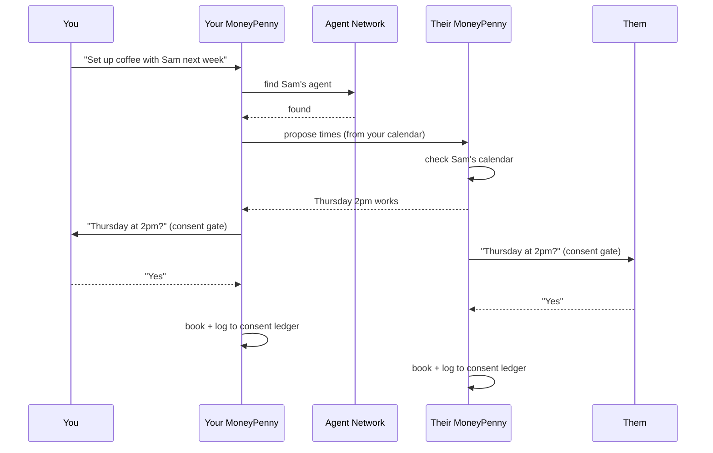

# MoneyPenny — The Assistant That Asks First

> *Your trusted right hand. It does real things in the world on your behalf — and never without your word.*

**Built at the UC Berkeley AI Hackathon.**

---

## The Problem

Today's AI can write you a beautiful email. It cannot send it. It can suggest three times for a meeting. It cannot actually find the one that works for both you *and* the person you're meeting. The moment a task touches the real world — your inbox, your calendar, your files, another human being — the AI taps out and hands the work back to you.

The few assistants that *can* act have the opposite problem: they act too freely. They'll run a command, send a message, or change something on your behalf without ever stopping to ask. Convenient — until it does something you didn't want, and you find out after.

**MoneyPenny is built on one principle: an assistant should be able to do real things in the world — but never without your permission.** A great assistant doesn't just do what you say — it knows what to handle, what to check, and what never to send without your word. MoneyPenny guards the line between *what you asked for* and *what actually happens*.

---

## Meet MoneyPenny

MoneyPenny is a voice-driven personal assistant that actually *acts* on your behalf. You speak to it the way you'd ask a capable, trustworthy person:

- *"Email my team that standup moves to 10."*
- *"Save these notes to my Drive."*
- *"What did I tell you about the Henderson project last week?"*
- *"Set up coffee with Sam sometime next week."*

It understands you, figures out what needs to happen, and does it — **but every action with real consequences pauses for your approval first.** You see exactly what it's about to do and say "send it," "cancel," or "change the time" — out loud. Nothing leaves your hands without your word.

That's the whole personality of MoneyPenny: **capable, but never presumptuous.**

---

## The Big Idea: Your MoneyPenny Talks to Mine

This is where MoneyPenny goes somewhere new.

Most assistants live on an island. They can act for *you*, but they can't reach anyone else's assistant. So the hardest, most annoying coordination problems — *"when are we both free?"*, *"can your side handle this part?"* — still land back on two humans emailing each other.

**MoneyPenny agents can find and talk to one another.**

When you ask MoneyPenny to set up coffee with Sam, your MoneyPenny doesn't email Sam. It finds **Sam's MoneyPenny**, and the two assistants negotiate directly — comparing calendars, proposing times, ruling out conflicts — then come back to each of you with a single answer to approve. Two assistants did the back-and-forth. Two humans just said "yes."

And it isn't limited to people you know. MoneyPenny can also reach across an open network of agents to **hire a specialist** — a restaurant-booking agent, a flight-finder, a research agent — for jobs your own MoneyPenny can't do alone.

The principle holds the whole way down: **agents negotiate, humans decide.** Even when my MoneyPenny is talking to yours, neither of us can be committed to anything until each owner approves it. Each MoneyPenny looks after its own boss's side of the deal. Consent isn't a feature bolted on top — it's the rule the entire network runs by.

---

## How It Works — A Day With MoneyPenny

**Morning.** You sit down, tap the power button, and MoneyPenny greets you by name. It remembers you — your preferences, your contacts, what you worked on yesterday.

**A quick email.** *"Email Priya that the deck is ready."* MoneyPenny drafts it and shows you a review card. You glance at it: *"Make it a little more casual."* It rewrites. *"Send it."* Gone. A confirmation appears, and the action is quietly recorded in your consent log — proof of exactly what you approved.

**Coordinating with another human.** *"Find a time for a 30-minute sync with Marcus this week."* Marcus also uses MoneyPenny. Behind the scenes, your assistant and his trade proposals against both calendars and land on Thursday at 2. Each of you gets one clean question: *"Thursday at 2pm work?"* You both say yes. Booked. Neither of you sent a single "does this work for you?" message.

**Reaching beyond your circle.** *"Book us a table somewhere good near the office for four on Friday."* Your MoneyPenny doesn't know restaurants — so it hires an agent that does, out on the open network. It comes back with options, you pick one, you approve the booking. The specialist agent is paid automatically for its help.

**Throughout, you're in control.** Every consequential step — the email, the meeting, the reservation — waited for your "yes." And every one of them is traceable: you can see what MoneyPenny did, why, and that nothing happened without you.

---

## Key Features

- **Voice-first.** Talk to MoneyPenny naturally. It listens, thinks, and answers out loud, in real time.
- **It actually does things.** Sends email, manages your calendar, searches the web, messages and calls people, and saves files to Google Drive.
- **Consent gate on every real action.** Anything with consequences pauses for your spoken approval — approve, cancel, or revise.
- **Agent-to-agent coordination.** Your MoneyPenny can talk to other people's MoneyPenny agents to handle two-sided tasks like scheduling.
- **An open agent network.** MoneyPenny can discover and hire specialist agents for jobs it can't do alone.
- **It remembers you.** Preferences, contacts, and context carry across sessions — it gets more useful the more you use it.
- **A consent ledger.** Every approval and denial is logged, so there's always a clear record of what MoneyPenny did on your behalf.
- **Provable trust.** MoneyPenny continuously checks its own behavior to confirm that no action ever bypassed your approval — and can show you the proof.

---

## The Consent Principle

Most agentic AI optimizes for *seamlessness* — fewer interruptions, more autonomy, get out of the user's way. MoneyPenny deliberately does the opposite where it counts.

We believe the assistants that earn a real place in people's lives won't be the ones that do the most on their own — they'll be the ones people **trust** to do things on their own. And trust isn't a vibe; it's a guarantee you can verify.

So MoneyPenny makes consent a structural property, not a polite habit:

1. **Every consequential action stops for approval.** Sending, booking, sharing, spending — all of it waits for you.
2. **Every decision is recorded.** The consent ledger is an honest, reviewable history of what you approved.
3. **The guarantee is checked, not just claimed.** MoneyPenny evaluates its own traces against that ledger to confirm nothing slipped through. If an action ever fired without approval, we'd know — and so would you.

*Other assistants ask you to trust that they did the right thing. MoneyPenny lets you check. Like the assistant it's named for, it's the desk everything passes through — and nothing reaches the outside world without going through you.*

---

## How MoneyPenny Is Different

The pieces exist separately in 2026 — but the combination doesn't. Agent-to-agent protocols are built to remove humans from the loop. Consumer assistants that take actions optimize for seamlessness, not consent. AI schedulers negotiate with the *other person*, not with their assistant.

| Capability | Agent-to-agent protocols | Big-tech assistants | AI schedulers | **MoneyPenny** |
|---|---|---|---|---|
| Agents discover & talk to each other | ✅ | ❌ | ❌ | ✅ |
| Takes real-world actions | enterprise | ✅ | scheduling only | ✅ |
| Per-action consent gate (by voice) | ❌ | ⚠️ minimal | ❌ | ✅ core |
| **Two-sided human approval** in agent-to-agent | ❌ | ❌ | ❌ | ✅ |
| Personal / peer-to-peer | ❌ | ✅ | ✅ | ✅ |
| Provable, auditable trust | ❌ | ❌ | ⚠️ | ✅ |

Everyone else is racing to take humans *out* of the loop. MoneyPenny deliberately keeps them in — and makes that verifiable.

---

## Architecture

```
                          You (voice)
                              │
                  ┌───────────▼────────────┐
                  │   Voice Interface        │   real-time speech in/out
                  │   (Deepgram)             │
                  └───────────┬─────────────┘
                              │
                  ┌───────────▼─────────────┐
                  │   MoneyPenny Orchestrator │   understands intent,
                  │   (Pydantic AI)           │   delegates to the right
                  └───────────┬─────────────┘   specialist
        ┌──────────┬──────────┼──────────┬──────────┬──────────┐
        ▼          ▼          ▼          ▼          ▼          ▼
     Email     Calendar    Search    Comms     Knowledge    Drive
     Agent      Agent      Agent     Agent       Agent      Agent
        │          │          │          │          │          │
        └──────────┴────► CONSENT GATE ◄──────────┴──────────┘
                          (approve / cancel / revise, by voice)
                              │
              ┌───────────────┼────────────────┐
              ▼               ▼                ▼
        Consent Ledger   Memory + Vector    Safety Evals
        (Redis Streams)  Knowledge (Redis)  (Arize Phoenix)

                  ╔═══════════════════════════════╗
                  ║   THE OPEN AGENT NETWORK        ║
                  ║   (Fetch.ai — uAgents on        ║
                  ║    Agentverse, found via        ║
                  ║    ASI:One, talking over the    ║
                  ║    Chat Protocol)               ║
                  ╚═══════════════════════════════╝
                              ▲   ▲
                              │   │
          ┌───────────────────┘   └────────────────────┐
          │                                             │
   Another person's                            A specialist agent
   MoneyPenny agent                            (e.g. restaurant booking)
   (peer-to-peer:                              (hired & paid through
   schedule between two people)                the consent gate)
```

### How an agent-to-agent task flows



---

## Tech Stack — and Why

| Layer | Technology | Why it's here |
|---|---|---|
| **Voice** | Deepgram | Real-time, low-latency speech in and out — the natural way to talk to an assistant |
| **Reasoning & delegation** | Pydantic AI + an LLM | A clean orchestrator that routes each request to the right specialist agent |
| **The agent network** | Fetch.ai (uAgents, Agentverse, ASI:One, Chat & Payment Protocols) | Lets MoneyPenny agents *find and talk to each other* — the heart of the cross-agent feature |
| **Memory & knowledge** | Redis | Cross-session memory, semantic recall of what MoneyPenny knows about you, and the consent ledger |
| **Trust & observability** | Arize Phoenix | Traces every action and proves none bypassed your consent |
| **Real-world actions** | Resend (email), Google Calendar, Google Drive, web search, macOS Messages | The things MoneyPenny can actually *do* |

---

## The Zero-Trust Physical Consent Gate (Hardware)

*A Raspberry Pi 5 running QNX that turns consent into something you physically touch — a 2FA token for high-stakes actions that no LLM can press for you.*

The software consent gate already blocks every side effect until a human approves. The hardware token makes that approval **out-of-band**: the decision happens on a physical switch the model has no access to.

- **I2C LCD1602** — shows the pending action: `[PENDING] Confirm Sync with Marcus?`
- **RGB LED** — slowly pulses **yellow** while a consequential action awaits approval (common-anode, inverted GPIO logic).
- **Touch switch** — you physically **tap to approve**; long-press to cancel.
- **Active buzzer** — a satisfying **chirp** + **green flash** confirms execution.

With `PHYSICAL_CONSENT_REQUIRED=1`, the browser/voice UI can *preview* an action but **cannot approve it** — only a tap on the Pi can. If the token is offline, the system **fails closed**. The tap still flows through the same HMAC consent token, ledger, and execution lock as every other approval.

Two transports are supported so it works on any network (including a phone hotspot with only IPv6):

- **Mode A** — the Pi connects out to the laptop over WebSocket (`/ws/device`).
- **Mode B** — the laptop connects to a tiny RPC server on the Pi (`consent_hw_server.py`), ideal when only the laptop can resolve the Pi by name.

On QNX the GPIO/I2C use the native `rpi_gpio` + `smbus` modules — no `lgpio`, no extra packages. Full wiring, QNX setup, and protocol: **[docs/hardware/consent-token-gate.md](docs/hardware/consent-token-gate.md)**.

```bash
# On the Pi (QNX)
python hardware/consent_hw_server.py --qnx

# On the laptop (.env)
CONSENT_HW_HOST=qnxpi24.local
PHYSICAL_CONSENT_REQUIRED=1
```

---

## Getting Started

> ⚠️ Prototype — built during a hackathon. Calendar uses the Google Calendar API (via your Workspace connection); messaging features use macOS-native APIs. A hosted demo mode simulates them so anyone can try the full flow from a browser.

### Prerequisites

- Python 3.13+, Node.js 18+, [uv](https://docs.astral.sh/uv/)
- API keys: OpenAI, Resend, Serper (optional: Deepgram, Redis, Google OAuth)
- Observability: [Phoenix local or cloud](docs/observability/phoenix.md) (optional for dev; recommended for staging)
- (Optional) A Fetch.ai / Agentverse account for the agent network features

### Run it

```bash
git clone <your-repo-url>
cd sss
uv sync
cd frontend && npm install && cd ..

# Terminal 1 — backend (WebSocket on ws://localhost:8765/ws)
uv run python server.py

# Optional — Phoenix traces UI (local)
uv run phoenix serve

# Terminal 2 — frontend
cd frontend && npm run dev
```

Open the app, press the orb to connect, type an instruction (e.g. *Email Priya the deck is ready*), and approve actions from the Field Log card.

### Try the live demo

A hosted version is available at **[your-demo-url]**. Open it, choose "Try as Guest," and MoneyPenny will greet you as a demo persona — no setup required. You'll be asked to approve a quick Google sign-in to enable the Drive feature (it only ever touches files MoneyPenny creates, never your existing ones).

---

## Roadmap

- [x] Voice assistant with orchestrator + specialist agents
- [x] Consent gate — approve / cancel / revise by voice
- [x] Email, calendar, search, messaging, and knowledge agents
- [ ] Voice layer on Deepgram (real-time, low-latency)
- [ ] Cross-session memory + semantic knowledge (Redis)
- [ ] Consent ledger + self-checked safety evals (Redis + Arize)
- [ ] Google Drive agent with least-privilege access
- [ ] **Agent-to-agent coordination — peer-to-peer scheduling between two MoneyPenny users**
- [ ] **Open-network hiring — discover and pay specialist agents (Fetch.ai)**
- [ ] Consent policies — set trust tiers so MoneyPenny only interrupts when it matters
- [ ] Proactive reminders — MoneyPenny reaches out to you first
- [x] **Zero-trust physical consent gate — Raspberry Pi 5 + QNX (LCD, RGB, touch, buzzer)**

---

## Team

Built by a team of two at the UC Berkeley AI Hackathon.

*[Add names, roles, and contact here.]*

---

## License

MIT — see [LICENSE](LICENSE).