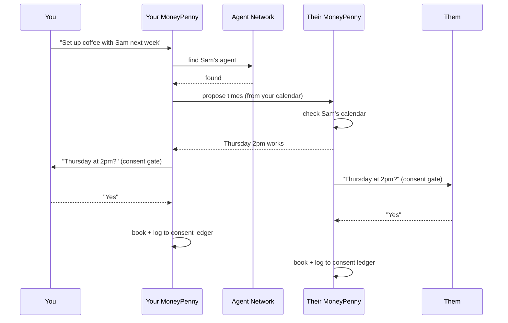

# The Multi-Agent System

> How MoneyPenny is organized as a fleet of cooperating agents — internally
> (an orchestrator delegating to specialists) and externally (independent
> agents finding and negotiating with each other across an open network).

MoneyPenny is multi-agent in **two distinct senses**, and they solve different
problems:

1. **Inside one MoneyPenny** — an orchestrator delegating to specialist sub-agents.
2. **Across MoneyPennys** — independent agents on an open network finding and
   negotiating with one another.

---

## Layer 1 — Orchestrator + specialist agents

A single **Orchestrator** (Pydantic AI) understands intent and delegates to the
right specialist. It does not do the work itself — it routes.

Under it sit the **specialist agents**, each owning one domain:

| Agent | Domain |
|---|---|
| Email | drafting & sending mail |
| Calendar | create / view / update / delete events, free-busy |
| Search | web search |
| Comms | messages & calls |
| Knowledge | remembering preferences, contacts, context |
| Drive | files (least-privilege — only files it creates) |
| Gmail | reading & triaging the inbox |
| Agentverse | discovering & messaging external agents (see Layer 2) |

The orchestrator reaches each one through a `delegate_*` tool — `delegate_email`,
`delegate_calendar`, `delegate_drive`, and so on. This is a clean
**router-and-experts** design: the orchestrator decides *who* should handle a
request and hands off the full request; the specialist decides *how*.

```
                  ┌──────────────────────────┐
                  │   MoneyPenny Orchestrator │   understands intent,
                  │   (Pydantic AI)           │   delegates to the right
                  └───────────┬──────────────┘   specialist
     ┌──────────┬─────────────┼──────────┬──────────┬──────────┐
     ▼          ▼             ▼          ▼          ▼          ▼
   Email     Calendar      Search     Comms     Knowledge    Drive
   Agent      Agent        Agent      Agent       Agent      Agent
     │          │             │          │          │          │
     └──────────┴────► CONSENT GATE ◄────┴──────────┴──────────┘
                       (approve / cancel / revise)
```

### The key architectural move

Every specialist, no matter its domain, funnels consequential actions through
**one shared consent gate**. Consent isn't implemented per-agent; it's a single
chokepoint the whole fleet passes through, backed by the consent ledger and
self-checked safety evals.

That's what makes "nothing happens without your word" a *structural* guarantee
rather than something each agent has to remember to do — and it's why adding a
new specialist agent doesn't widen the trust surface: the new agent inherits the
same gate by construction.

---

## Layer 2 — The open agent network (agent-to-agent)

Most assistants are islands — they act for you, but can't reach anyone else's
assistant. MoneyPenny agents can **discover and talk to one another** over the
Fetch.ai network (uAgents on Agentverse, found via ASI:One, talking over the
Chat Protocol).

Two modes:

- **Peer-to-peer (MoneyPenny ↔ MoneyPenny).** Ask to "set up coffee with Sam,"
  and your agent doesn't email Sam — it finds *Sam's* MoneyPenny, and the two
  negotiate directly: compare calendars, propose times, rule out conflicts, and
  return one answer to each owner. Two assistants do the back-and-forth; two
  humans just say "yes."

- **Hiring specialists (open network).** For jobs your own fleet can't do —
  book a restaurant, find a flight — MoneyPenny reaches across the network to
  **hire a specialist agent**, paid automatically through the consent gate
  (Fetch.ai Payment Protocol).

### The governing rule

> **Agents negotiate, humans decide.**

Even when my MoneyPenny talks to yours, **neither side is committed until each
owner approves**. Each agent looks after its own boss's side of the deal.



Both `YourMP` and `TheirMP` hit *their own* consent gate and wait for their
respective human before booking and logging.

---

## Why the combination is the novel part

| Capability | Agent-to-agent protocols | Big-tech assistants | AI schedulers | **MoneyPenny** |
|---|---|---|---|---|
| Agents discover & talk to each other | ✅ | ❌ | ❌ | ✅ |
| Takes real-world actions | enterprise | ✅ | scheduling only | ✅ |
| Per-action consent gate | ❌ | ⚠️ minimal | ❌ | ✅ core |
| **Two-sided human approval** in agent-to-agent | ❌ | ❌ | ❌ | ✅ |
| Provable, auditable trust | ❌ | ❌ | ⚠️ | ✅ |

Agent-to-agent protocols exist, but are built to remove humans from the loop.
Action-taking assistants exist, but optimize for seamlessness, not consent.
MoneyPenny's distinctive cell is **two-sided human approval inside
agent-to-agent coordination** — multiple autonomous agents collaborating across
a network, while *each* keeps its human in control and produces an auditable
record. The multi-agent system isn't just "more agents"; it's a network where
coordination scales but authority stays with people.

---

## Implementation map

| Concept | Where it lives |
|---|---|
| Orchestrator + `delegate_*` routing | `ai/agents/orchestrator.py` |
| Specialist agents | `ai/agents/agent1.py` … `agent8.py` |
| Shared consent gate | `ai/agents/consent.py` |
| Open-network hand-off (Agentverse) | `ai/agents/agent8.py` → `delegate_agentverse` |
| Agent-to-agent transport bridge | `ai/transport/bridge.py` |

> **Demo note:** the open-network layer (`agent8` / `delegate_agentverse`)
> depends on the Redis-backed transport bridge. When Redis is disabled for a
> fast local demo, the approval ticket for an agent hand-off still renders, but
> the message won't actually be delivered to a remote agent.
